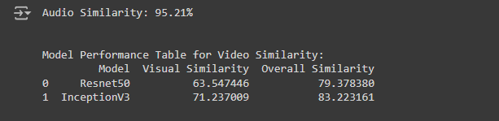

## Output

### How to Run main.py

- python -m venv venv
- .\venv\Scripts\activate (Windows User)
- pip install -r requirements.txt
- check your system have ffmpeg installed or not
  - winget install ffmpeg
- python main.py

### The full description of every function and the full process is in the notebook.(Video_Similarity.ipynb)
